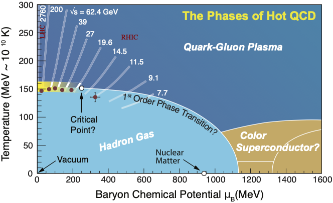
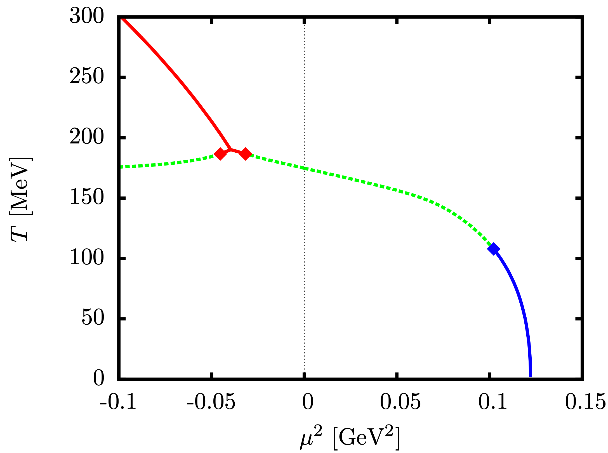
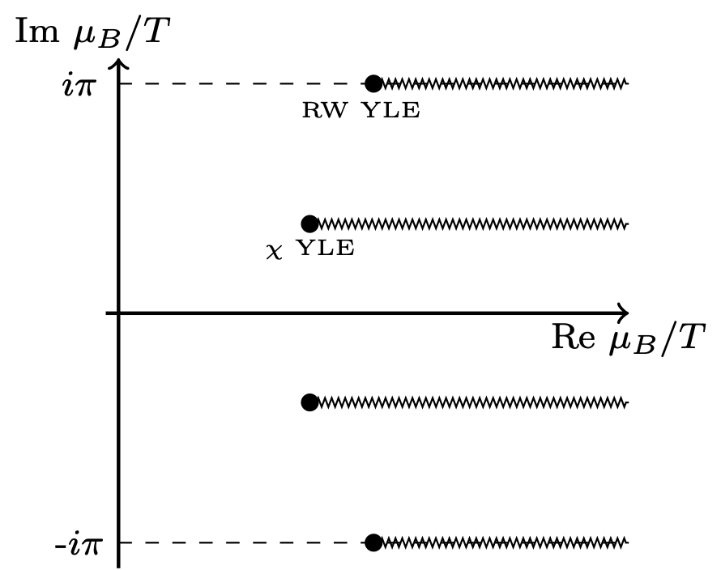
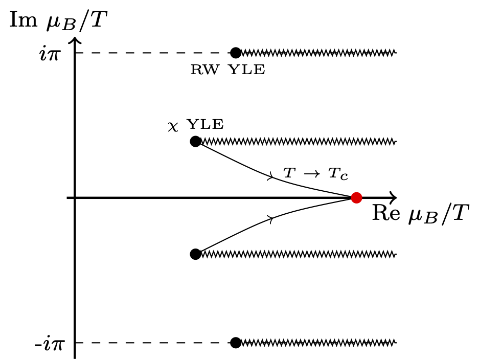
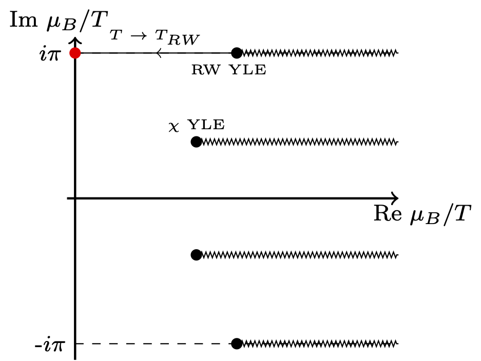
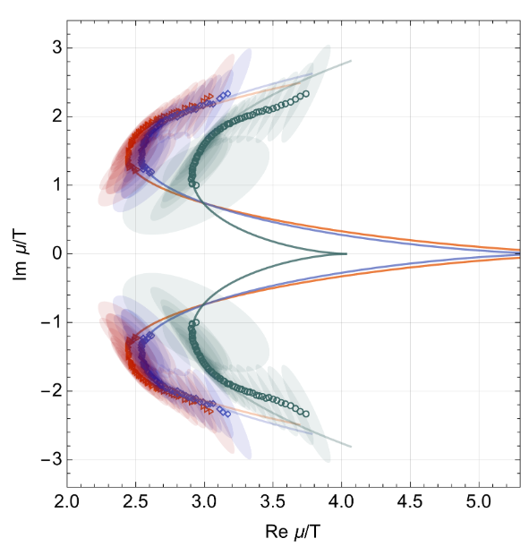
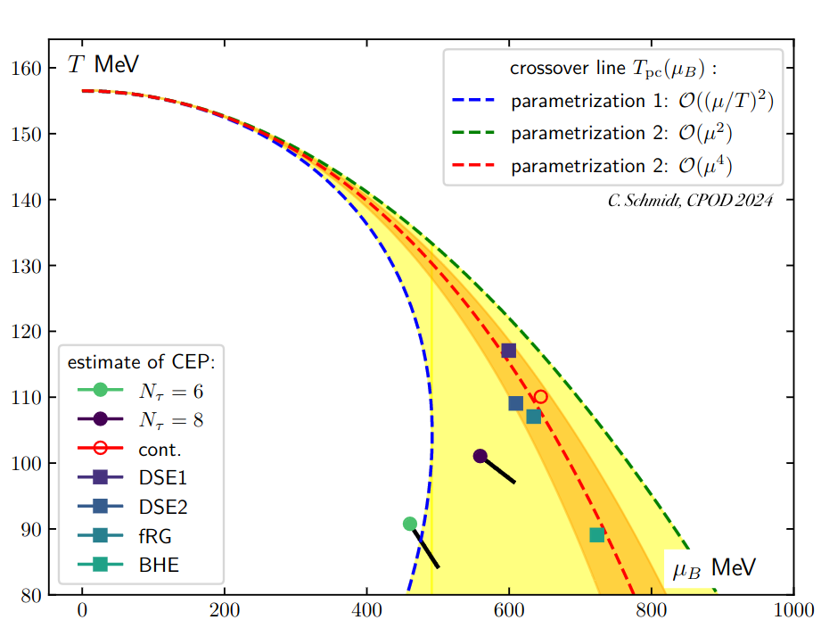
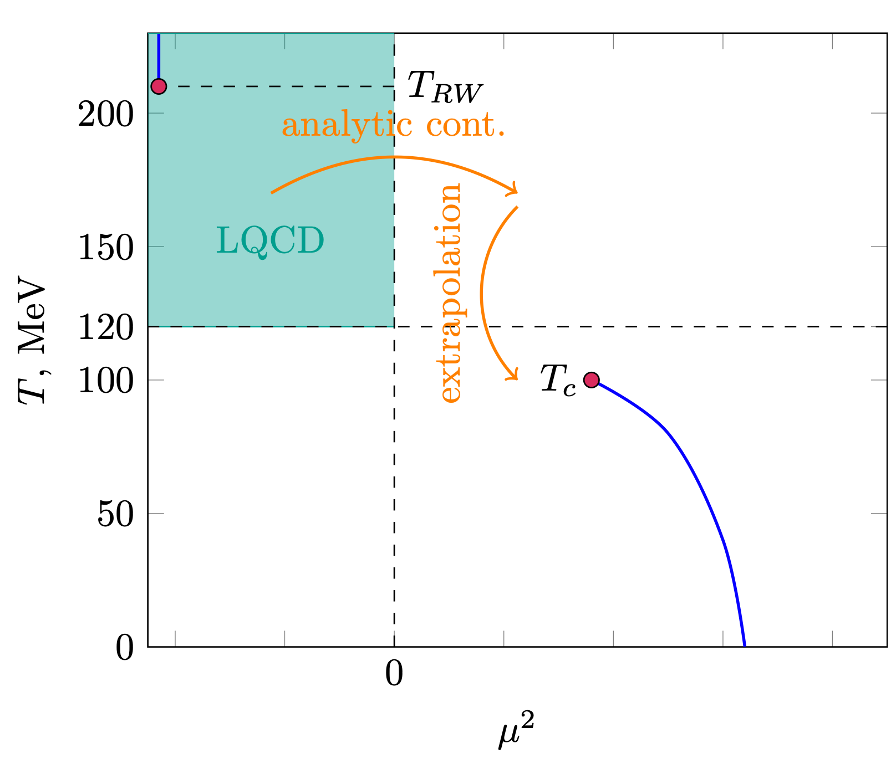

## ECT\* Workshop: Analytic Structure of QCD and Yang-Lee Edge singularity

Organizers:

- Gokce Basar
- Christian Schmidt-Sonntag
- Vladi Skokov

---

 <!-- .slide: data-transition="convex" -->

## Outline

- **Introduction**

  1. Why QCD analytic structure?

  2. State of the art

  3. Open questions

- **Goals of the workshop**

 

- **Timetable and workshop structure**

---

 <!-- .slide: data-transition="convex" -->

## QCD Phase diagram

---

 <!-- .slide: data-transition="convex" -->

## QCD Phase diagram: theory methods

- **Lattice Monte-Carlo**

_Talks throughout this week_

- **Functional methods**: Functional Renormalization Group / Dyson-Schwinger

_Talks by J. Pawlowski and F. Gao on Th_

 

### **Limitations:**

- Lattice QCD calculations are only feasible at zero baryon density due to the
  sign problem
- Functional methods require truncation improvement at larger values of chemical
  potential

  

---

 <!-- .slide: data-transition="convex" -->

## **Indirect methods:**

- Functional methods: failure of truncation indicate the approach to
  criticality?

- Lattice: Taylor series coefficients/imaginary $\mu$ $\to$ non-zero baryon
  density

`\[  \frac{p}{T^4} = \sum_{n=0}^{\infty} \frac{  \chi_n }{n!}\left(\frac{\mu}{T}\right)^n  \]`

---

 <!-- .slide: data-transition="convex" -->

## Taylor series expansion

- Consider an arbitrary function expanded around a regular point
  $$f(x) = \sum_{n=0}^{\infty} \frac{1}{n!}  f_n x^{n}$$

- What limits the predictive power of this expansion?

$$|x| < R_c \equiv \left(  \lim_n \sup \left| f_n^{1/n} \right| \right)^{-1}$$

- $R_c$ is the radius of convergence
- $R_c =$ distance in the **complex** plane from the expansion point to the
  nearest singularity

---

<!-- .slide: data-transition="convex" -->

## Two sides of the same coin

⚠️ Finite $R_c$ defines the limit beyond which naive application of Taylor series is fruitless

 

✅ $R_c$ encodes the location of the closest singularity, and thus a critical point

---

## Most omnipresent critical point

| Type of critical point:       | 
 protocritical = **YLE** 
 | critical | tricritical |
| ----------------------------- | --------------------------------------------------------------------------------- | -------- | ----------- |
| Number of relevant variables: | 
 1 
 &nbsp;                | 2        | 4           |

**YLE** = Yang-Lee edge singularity

1 independent crit. exp., c.f. standard critical point with 2 independent crit.
exp.

 

--

 <!-- .slide: data-transition="convex" -->

## Illustration in Ising model: $h = i |z_c|^{-\beta \delta} t^{\beta \delta}$

- In contrast to the critical point, YLE form lines
- YLE are continuously connected to critical point

---

## Universal location of YLE

For each universality class:

- universal magnetic equation of state
- **universal location of YLE singularity**
- mapping to QCD requires non-universal parameters

| d                                | 1   | 2          | 3        | 4           |
| -------------------------------- | --- | ---------- | -------- | ----------- |
| $ \| z_c \| /R\_\chi^{1/\gamma}$ | 1   | 1.32504(2) | 1.621(4) | $3/2^{2/3}$ |

Talks by F. Rennecke (Tue) and H.-L. Xu (Fr)

---

 <!-- .slide: data-transition="convex" -->

## Back to QCD phase diagram

---

 <!-- .slide: data-transition="convex" -->

## QCD: Expected analytic structure $T_c<T<T_{RW}$

Talks by M. Stephanov on Wed, S. Yin on Th

--

 <!-- .slide: data-transition="convex" -->

## QCD: Expected analytic structure $T\to T_c$

--

 <!-- .slide: data-transition="convex" -->

## QCD: Expected analytic structure $T\to T_{RW}$

---

 <!-- .slide: data-transition="convex" -->

## Tracing YLE singularity: RW critical point

Lattice QCD and indirect methods to locate YLE:

input from Im $\mu$ \& analytic continuation

$$
  z = z_c \to \text{Re} \mu_{YLE} \propto (T_{RW}-T)^{\beta \delta} \quad \leadsto T_{RW} = 211.1 \pm 3.1 \text{MeV}.
$$

_Talk by C. Schmidt on Tue_

---

 <!-- .slide: data-transition="convex" -->

## Tracing YLE singularity: chiral critical point

Lattice input from Taylor series coeff. at $\mu=0$ or Im $\mu$ \& analytic
continuation

G. Basar, 2312.06952  
D. Clarke et. al., 2405.10196

_Talks by K. Zambello after coffee break and G. Basar on Wed_

---

 <!-- .slide: data-transition="convex" -->

## Tracing YLE singularity: estimate for critical point

 

$$ T_c \approx 110 \text{ MeV} , \mu_c \approx 650 \text{ MeV}$$

 

---

 <!-- .slide: data-transition="convex" -->

## Tracing YLE singularity: systematics

 

 

⚠️ Double extrapolation

_Talk by A. Adam this afternoon_

---

 <!-- .slide: data-transition="convex" -->

## Goals of the workshop

- **Improve Understanding of QCD Equation of State Analytic Structure**

- **Assess Reliability of Analytic Continuation Methods for Singularity
  Location**

- **Develop Strategy to Minimize Systematic Errors in Locating QCD Critical
  Point**

- **Improve Understanding of Universal Analytic Structure Near Second-Order
  Critical Point**

---

## Workshop Strucutre

 <!-- .slide: data-transition="convex" -->
