## ECT\* Workshop: Analytic Structure of QCD and Yang-Lee Edge singularity

Organizers:

- Gokce Basar
- Christian Schmidt-Sonntag
- Vladi Skokov

Supported by FBK ECT\*, Bielefeld University, and CRC TR 211 (Strong interaction
matter under extreme conditions)

---

 <!-- .slide: data-transition="convex" -->

## Outline

- **Introduction**

 

1. Why QCD analytic structure?

2. State of the art

3. Open questions

 

- **Goals of the workshop**

 

- **Timetable and workshop structure**

---

 <!-- .slide: data-transition="convex" -->

## QCD Phase diagram

---

 <!-- .slide: data-transition="convex" -->

## QCD Phase diagram: theory

- **Lattice Monte-Carlo**

_Talks throughout this week_

- **Functional methods**: Functional Renormalization Group / Dyson-Schwinger

_Talks by J. Pawlowski and F. Gao on Th_

 

### **Limitations:**

 

- Lattice QCD calculations are only feasible at zero baryon density due to the
  sign problem
- Functional methods require truncation improvement at larger values of chemical
  potential

 

  

---

 <!-- .slide: data-transition="convex" -->

## **Indirect methods:**

- Functional methods: failure of truncation indicate the approach to
  criticality?
- Lattice: Taylor series coefficients/imaginary $\mu$ $\to$ non-zero baryon
  density

$$
\frac{p}{T^4} = \sum\_{n=0}^{\infty} \frac{ \chi_n
}{n!}\left(\frac{\mu}{T}\right)^n
$$

---

 <!-- .slide: data-transition="convex" -->

## Taylor series expansion

- Consider an arbitrary function expanded around a regular point

 

  $$f(x) = \sum_{n=0}^{\infty} \frac{1}{n!}  f_n x^{n}$$
 

- What limits the predictive power of this expansion?

 

$$|x| < R_c \equiv \left(  \lim_n \sup \left| f_n^{1/n} \right| \right)^{-1}$$
 

- $R_c$ is the radius of convergence
- $R_c =$ distance in **complex** plane from expansion point to nearest
  singularity

---

<!-- .slide: data-transition="convex" -->

## Two sides of the same coin

⚠️ Finite $R_c$ defines the limit beyond which naive application of Taylor series is fruitless

 

✅ $R_c$ encodes the location of the closest singularity, and thus a critical point

---

## Most omnipresent critical point

| Type of critical point:       | 
 protocritical = **YLE** 
 | critical | tricritical |
| ----------------------------- | --------------------------------------------------------------------------------- | -------- | ----------- |
| Number of relevant variables: | 
 1 
 &nbsp;                | 2        | 4           |

**YLE** = Yang-Lee edge singularity

1 independent crit. exp., c.f. standard critical point with 2 independent crit.
exp.

 

--

<!-- .slide: data-transition="convex" -->

## Illustration in Ising model $h = i |z_c|^{-\beta \delta} t^{\beta \delta}$

- In contrast to the critical point, YLE form lines
- YLE are continuously connected to critical point

---

## Universal location of YLE

For each universality class:

- universal magnetic equation of state
- **universal location of YLE singularity**
- mapping to QCD requires non-universal parameters

| d                                | 1   | 2          | 3        | 4           |
| -------------------------------- | --- | ---------- | -------- | ----------- |
| $ \| z_c \| /R\_\chi^{1/\gamma}$ | 1   | 1.32504(2) | 1.621(4) | $3/2^{2/3}$ |

_Talks by F. Rennecke (Tue) and H.-L. Xu (Fr)_

---

<!-- .slide: data-transition="convex" -->

## Back to QCD phase diagram

---

<!-- .slide: data-transition="convex" -->

## QCD: Expected analytic structure $T_c<T<T_{RW}$

_Talks by M. Stephanov on Wed, S. Yin on Th_

M. Stephanov, hep-lat/0603014

--

<!-- .slide: data-transition="convex" -->

## QCD: Expected analytic structure $T\to T_c$

--

<!-- .slide: data-transition="convex" -->

## QCD: Expected analytic structure $T\to T_{RW}$

---

## Naive mapping

<!-- .slide: data-transition="convex" -->

Near chiral transition

 

\begin{align} z &= z_0 \left( \frac{m_l}{m_s}\right)^{-\frac{1}{\beta\delta}}
\times \left[ \frac{T-T_c}{T_c} + \kappa^B_2 \left( \frac{\mu}{T_c} \right)^2 +
\kappa^B_4 \left( \frac{\mu}{T_c} \right)^4 + \dots \right] \,. \label{eq:z}
\end{align}

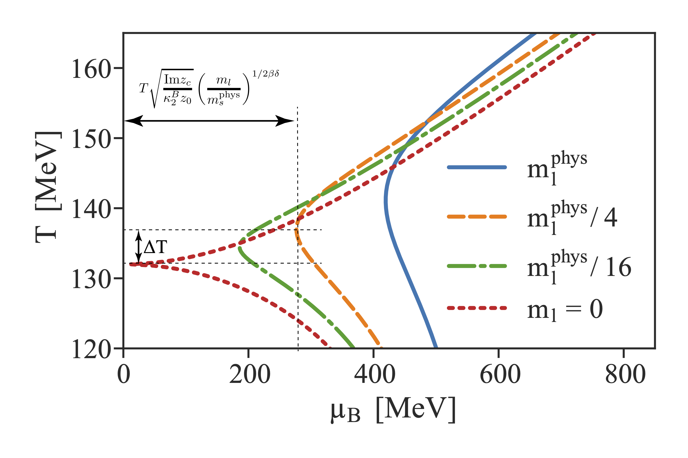

S. Mukherjee, V.S., 1909.04639

---

<!-- .slide: data-transition="convex" -->

## Tracing YLE singularity: RW critical point

Lattice QCD and indirect methods to locate YLE:

input from Im $\mu$ \& analytic continuation

$$
  z = z_c \to \text{Re} \mu_{YLE} \propto (T_{RW}-T)^{\beta \delta} \quad \leadsto T_{RW} = 211.1 \pm 3.1 \text{MeV}.
$$

_Talk by C. Schmidt on Tue_

 C. Schmidt et al,     2209.04345

---

<!-- .slide: data-transition="convex" -->

## Tracing YLE singularity: chiral critical point

Lattice input from Taylor series coeff. at $\mu=0$ or Im $\mu$ \& analytic
continuation

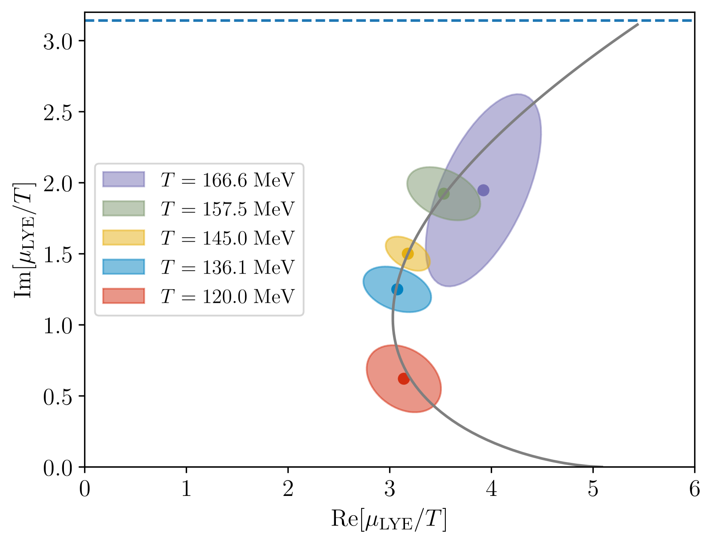

G. Basar, 2312.06952  
D. Clarke et. al., 2405.10196

_Talks by K. Zambello after coffee break and G. Basar on Wed_

---

<!-- .slide: data-transition="convex" -->

## Tracing YLE singularity: estimate for critical point

 

$$ T_c \approx 110 \text{ MeV} , \mu_c \approx 650 \text{ MeV}$$

 

---

<!-- .slide: data-transition="convex" -->

## Tracing YLE singularity: systematics

 

 

⚠️ Double extrapolation

_Talk by A. Adam this afternoon_

---

<!-- .slide: data-transition="convex" -->

## Goals of the workshop

- **Improve Understanding of QCD Equation of State Analytic Structure**

- **Assess Reliability of Analytic Continuation Methods for Singularity
  Location**

- **Develop Strategy to Minimize Systematic Errors in Locating QCD Critical
  Point**

- **Improve Understanding of Universal Analytic Structure Near Second-Order
  Critical Point**

---

<!-- .slide: data-transition="convex" -->

## Workshop

### Monday and Tuesday

**Lattice QCD**: extrapolations, systematics, new methods

**Discussion** on systematics os locating YLEs/LYZs and critical point

---

### Wednesday

**Amalytic strucutre**

**Analysis of lattice data**

**Discussion** on analytic strucutre

**Free afternoon and Workshop dinner**

---

<!-- .slide: data-transition="convex" -->

### Thursday

**Functional methods**

### Friday

**Universal location of YLE** in Ising model

---

<!-- .slide: data-transition="convex" -->

# Discussion

---

<!-- .slide: data-transition="convex" -->

## Interval dependence

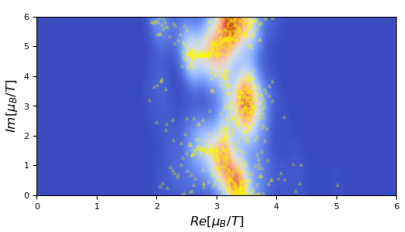

- Are there exact results?

- Interpolating from imaginary line vs Taylor series: "radius of convergence" is
  due to the singularity closest to the line vs closest to the expansion point

 

---

<!-- .slide: data-transition="convex" -->

## Second LYZ

- Any hope to perform finite volume analysis?

_Talk by Masakiyo Kitazawa on Wed_

---

<!-- .slide: data-transition="convex" -->

## Re $\mu_{YLE}$ and the relation to the crossover line

 

Lattice analyses of LYZ gives the parametrization for Re $\mu_{YLE}$ and Im
$\mu_{YLE}$ near the point where the latter quantity vanishes. Does the line
$\mu = Re \mu_{YLE} (T)$ follow the "crossover" line?

---

<!-- .slide: data-transition="convex" -->

## Re $\mu_{YLE}$ and the relation to the crossover line

 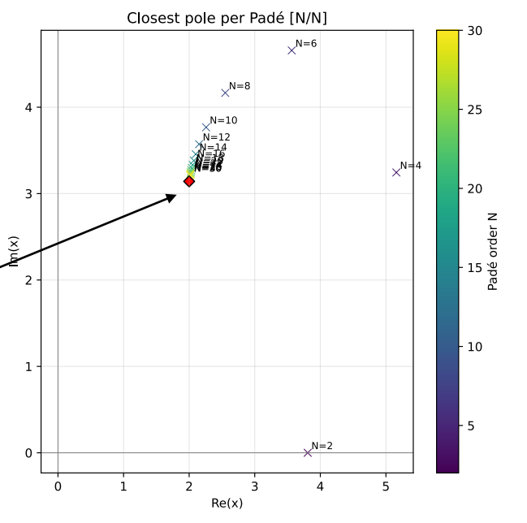

- Current QCD calculations use Pade[3,3], Pade[4,4], Pade[5,5]

- If the shape of the curve depends on the position of the singularity, it may
  fake the YLE trajectory

---

<!-- .slide: data-transition="convex" -->

## Scaling for strange neutral eos?

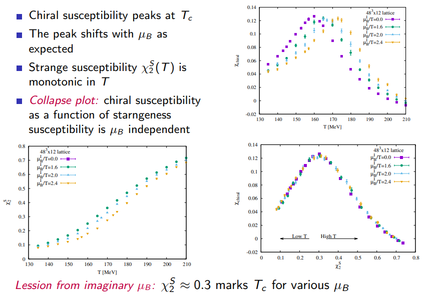

- What is the origin?
- Very large values of $z$...

---

<!-- .slide: data-transition="convex" -->

# Discussion: Thursday

---

<!-- .slide: data-transition="convex" -->

## Scaling: Model

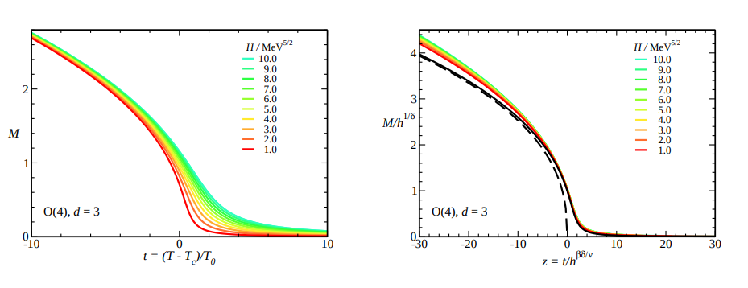

- Why not the pion mass...
- Very large values of $z$...

_Braun and Klein_

---

<!-- .slide: data-transition="convex" -->

## Scaling: Model

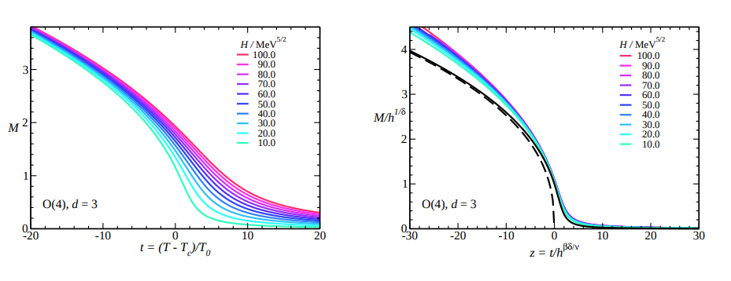

- Why not the pion mass...
- Very large values of $z$...

_Braun and Klein_

---

<!-- .slide: data-transition="convex" -->

## Scaling: Model

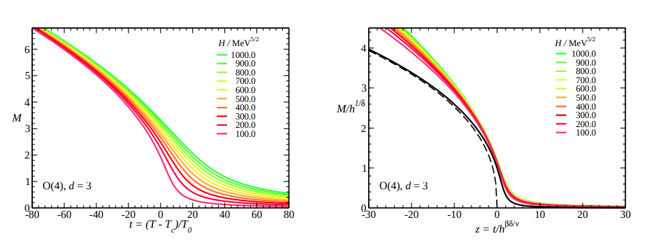

- Why not the pion mass...

_Braun and Klein_

---

<!-- .slide: data-transition="convex" -->

## Scaling: LQCD

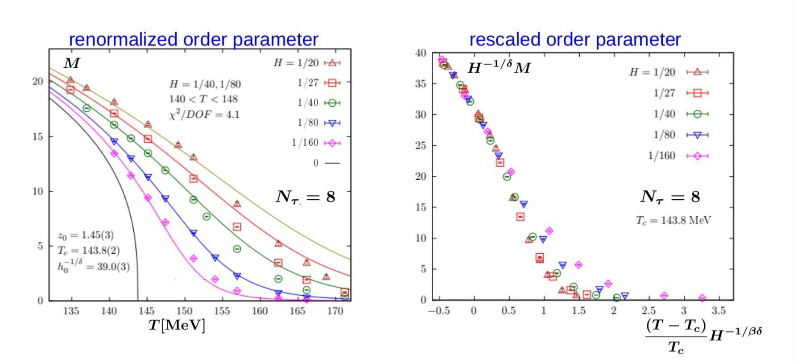

- The scaling is not perfect
- Quite significant deviation rate at small masses
- Why not to use the conventional normalization...

---

<!-- .slide: data-transition="convex" -->

## YLE trajectory... DSE, LQCD, what about FRG?

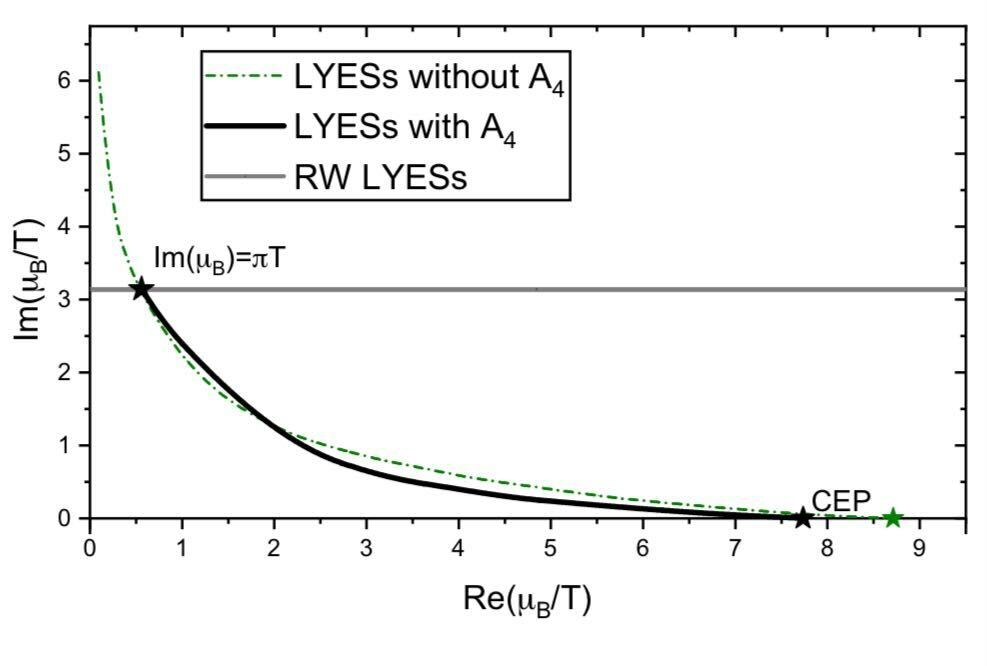
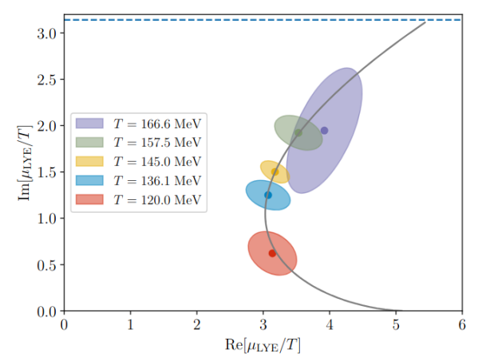

---

<!-- .slide: data-transition="convex" -->

## Lifshitz point; corresponding YLE?

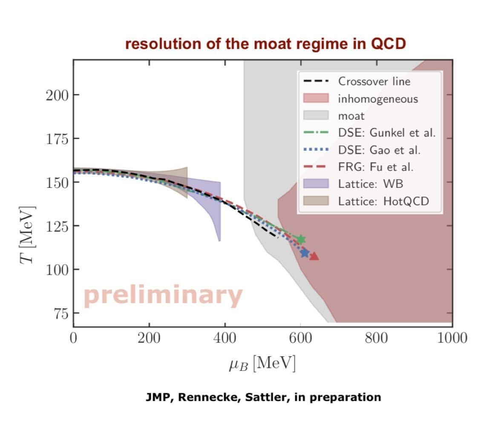
